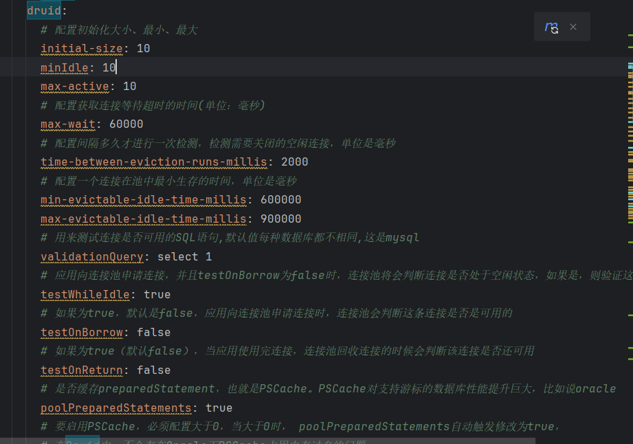

# ExcelletHelper
基于 Spring Boot + Redis + MySQL+ Elasticsearch+Sentinal+Nacos的考公题练习平台。管理员和用户可以创建考公相关题库和题目供用户自主学习。
## redis实现签到功能代码分析
1. 使用LinkedHashMap保证获取的结果有先后顺序，符合签到结果返回（时间上）
2. 将整个bitset缓存到内存中
3. 只获取下一个签到的日期
```java
 public ArrayList<Integer> getUserSignInRecord(long userId, Integer year) {
        if (year == null) {
            LocalDate date = LocalDate.now();
            year = date.getYear();
        }
        String key = RedisConstant.getUserSignInRedisKey(year, userId);
        RBitSet signInBitSet = redissonClient.getBitSet(key);
        // LinkedHashMap 保证有序
LinkedHashMap<LocalDate,Boolean> resultMap = new LinkedHashMap<>();
        // 获取当前年份的总天数
        int totalDays = Year.of(year).length();

        //基于内存的bitset
        BitSet bitSet = signInBitSet.asBitSet();
        // 依次获取每一天的签到状态(是不是有点重复)
        ArrayList<Integer>  signList  = new ArrayList<>();
      int index=bitSet.nextSetBit(0);
     while(index<totalDays){
            signList.add(index);
            index =bitSet.nextSetBit(index+1);
         /*   // 获取 key：当前日期(即给出一年中的第几天，算出日期)
            LocalDate now = LocalDate.ofYearDay(year, i);
            // 获取 value：当天是否有刷题
            boolean isRecord = bitSet.get(i);
            if(isRecord){
                resultMap.put(now,isRecord);
            }*/
        }
            // 将结果放入 map
return signList;
    }
```
## 批量操作
定位方法`batchAddQuestionsToBankInner`

使用了Mybatis的`saveBatch`方法和`@Trancsation`注解
## Druid连接池优化
引入Maven:
```xml
  <dependency>
            <groupId>com.alibaba</groupId>
            <artifactId>druid-spring-boot-starter</artifactId>
            <version>1.2.23</version>
        </dependency>
```
配置文件如下:

